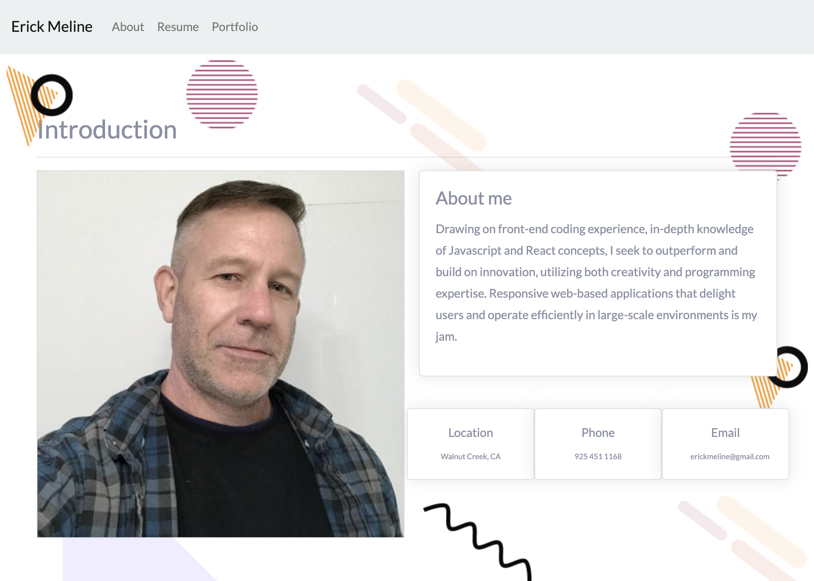

# Portfolio 4
Yet another time-sucking portfolio project.

## Uses

JS/React/Bootstrap/Parallax

-----------

## Installation Instructions

```
npm install
```

-----------

## Usagage Information

```
npm start
```

-----------

## Live Demo

https://erickmeline.github.io/Portfolio4/

-----------

## Screen shot


-----------

## Code example - nothing special here
```
    <nav className="navbar navbar-expand-lg navbar-light bg-light">
      <a href="/" className="navbar-brand">Erick Meline</a>
      <button className="navbar-toggler" type="button" data-toggle="collapse" data-target="#navbarNavAltMarkup" aria-controls="navbarNavAltMarkup" aria-expanded="false" aria-label="Toggle navigation">
        <span className="navbar-toggler-icon"></span>
      </button>
      <div className="collapse navbar-collapse" id="navbarNavAltMarkup">
        <div className="navbar-nav">
          <a href="/" className="nav-item nav-link">About</a>
          <a href="/resume" className="nav-item nav-link">Resume</a>
          <a href="/portfolio" className="nav-item nav-link">Portfolio</a>
        </div>
      </div>
    </nav>
```

-----------

## Questions
Reach out with additional questions:

[https://github.com/erickmeline](https://github.com/erickmeline) - [erickmeline@gmail.com](mailto://erickmeline@gmail.com)
